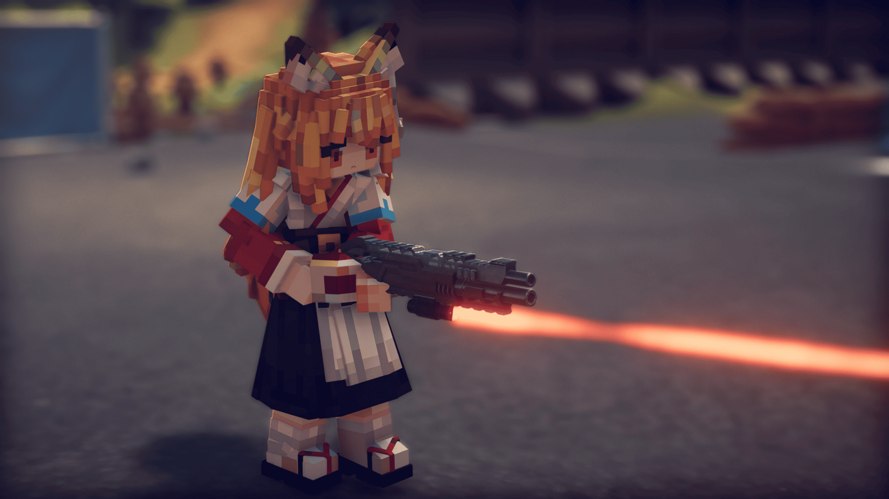

## [逃离鸭科夫]酒狐mod工程文件

<div align="center"></div>

### 项目简介

这是一个逃离鸭科夫的酒狐模组。本模组基于[自定义模型管理器](https://github.com/BAKAOLC/DuckovCustomModel)运行。

### 环境要求
- Unity 2022.3 LTS 或更高版本，推荐2022.3.62f2
- .NET Framework 4.7.1+

### 安装说明
1. 克隆或下载本项目到本地
2. 使用Unity Hub打开项目文件夹
3. 等待Unity导入所有资源

### 项目结构
```
Assets/
├── Animation         # 角色动画
├── Controller/       # 角色控制器
├── Scenes/           # 游戏场景
├── Materials/        # 材质文件
├── Sounds/           # 角色语音
└── Prefabs/          # 预制件

```